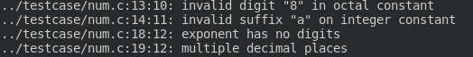
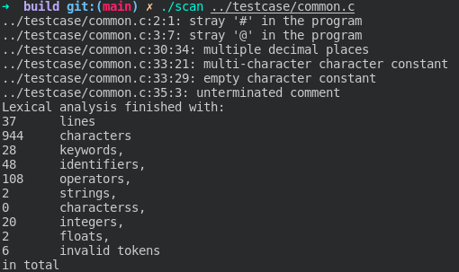
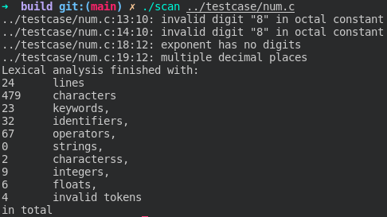
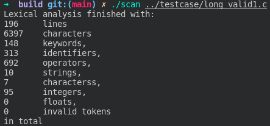
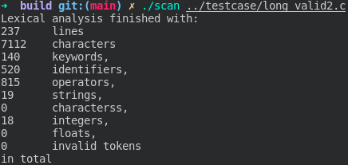
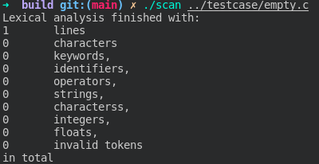

## 实验环境
本实验在Ubuntu 20.04下，使用g++ 9.3.0，cmake 3.21.0开发。
## 程序设计
本程序主要由3个模块组成
### token
每一个token应当是以`<classification, attribute>`的形式表示

`classification` 表示token的属性; `attribute`表示token对应的属性值

设计有以下分类
```cpp
enum Classification
{
	TOKEN_INVALID,      // 非法token
	TOKEN_EOF,          // 文件末尾
	TOKEN_KEYWORD,      // 关键字
	TOKEN_IDENTIFIER,   // 标识符
	TOKEN_OPERATOR,     // 运算符
	TOKEN_STRING,       // 字符串常量
	TOKEN_CHARACTER,    // 字符常量
	TOKEN_INTEGER,      // 整数常量
	TOKEN_FLOAT         // 浮点数常量
};
```
设计对应的属性值
```cpp
union token
{
	// 关键字类型
	Keyword keyword; 
	// 变量名对应的字符串指针,由符号表维护
	std::string* name; 
	// 运算符类型
	Operator operator_;
	// 字符串常量对应的字符串指针,由符号表维护
	std::string* stringValue;
	// 储存整数或者字符常量
	i64 integerValue;
	// 浮点数值
	double floatValue;
}u;
```
**这样设计的好处在于每一个token仅会占用有限的空间，构造的时间、空间开销均比较小**

token还维护了一个位置信息`Location`，储存了所属的文件、行、列，这对于调试以及记录信息有重大意义。

此外，token还应包含构造各类token的方法，具体实现见代码，限于篇幅不进行具体描述。

### lexer
**lexer是词法分析的核心部分。** 

一个lexer对象应当可以打开一个文件，每次调用`getNextToken()`方法后，从文件中读出一个token并返回。如果遇到一些错误，应当打印出错误信息和错误位置，并恢复成能够继续进行词法分析的状态。

为了实现以上功能，lexer包含以下部分
+ buffer
+ 识别各类token的子函数
+ 符号表
+ 输出错误信息的函数
+ 其他变量

具体信息见[lexer的实现](#lexer实现)

### scan
整个程序的入口部分，读取要处理的文件名，调用lexer对象，得到单词流，并将得到的结果格式化输出到目标文件中。此外输出文件的统计信息。

## lexer实现
### 输入缓冲区
考虑维护两个4096bytes的缓冲区，以及一个向前指针`forward`。由于C++提供了std::string容器，我们能够更加轻松地记录读取到的内容而无需维护`lexemeBegin`指针。
```cpp
char buf[2 * (lexdef::BFSZ + 1)]; // buffer
char *forward; // 向前指针
char *_begin[2] = {buf, buf + lexdef::BFSZ + 1}; // 缓冲区开始位置
char *_end[2] = {buf + lexdef::BFSZ, buf + 2 * lexdef::BFSZ + 1}; // 缓冲区结束位置
char Lexer::nextChar()
{
    char charRead = *forward;
    charCount++; colCount++;
    if (charRead == '\n')
        rowCount++, colCount = 1;
    if (*++forward == lexdef::eof) {
        if (forward == _end[0]) {
            terminateFlag = !loadBuf(1);
            forward = _begin[1];
        }
        else if(forward == _end[1]) {
            terminateFlag = !loadBuf(0);
            forward = _begin[0];
        }
        else /* eof within a buffer marks the end of input */
        {
            terminateFlag = true;
        }
    };
    return charRead;
}
```
每次调用`nextChar()`，我们能从缓冲区中取出一个字符，并将`forward`移动至下一个合法位置，如果缓冲区已经读取完成，则重新填充该缓冲区，全部文件读取完毕则会将`terminateFlag`设置为true，以便后续结束词法分析。

### 符号表
符号表是用于储存**标识符**和**字符串常量**的表。其它类型如整数、浮点数和字符常量可以直接表示，关键字与运算符则设计了对应的enum类型，因此并不需要在符号表中储存。

符号表的核心使用了`std::unordered_map`，它是一个基于`hash`的数据结构，搜索、插入的平均时间复杂度均为$O(1)$，十分优秀。

符号表设计如下：
```cpp
    class SymbolTable {
    private:
        std::unordered_map<std::string, std::string*> stab;
        // check entry existance
        std::string* findItem(const std::string& item);
    public:
        // add a new item to the symbol table
        std::string* update(const std::string& item);
    };
    std::string* SymbolTable::findItem(const std::string& item)
    {
        auto iter = stab.find(item);
        return iter == stab.end() ? nullptr : (*iter).second;
    }
    std::string* SymbolTable::update(const std::string& item)
    {
        auto addr = findItem(item);
        return addr ? addr : stab[item] = new std::string(item);
    }
```
对于每一个要更新的字符串，首先查询符号表中是否含有这个字符串。如果有，则返回存有这个字符串信息的指针；否则新建一个相应的指针对象，并将其加入符号表。

这样做的好处在于每一个特定的字符串仅会被储存唯一一次，并且能将其以指针的形式存入token，既节省了空间，又提升了效率。

### 识别token
要从lexer获取一个token，需要调用`getNextToken()`。

考虑到对于各类合法token，每一类的起始字符均不相同，我们可以首先观察待读入的字符，通过不同的条件进入识别各个类型token的子函数。如果没能找到到一个能识别以某一个字符开头的token的函数，则这个字符显然是非法字符，我们会输出错误信息并返回一个非法类型的token。

**每一个子程序结合了DFA的思想，按照对应的词法规则识别token。**

简要说明各个子函数的功能：

+ `Token scanNumber()`

	识别8进制、16进制整数，和10进制的有理数。
	
+ `Token scanIdentifier()`

	识别关键字和标识符。

+ `Token scanString()`

	识别字符串常量(含转义字符)

+ `Token scanCharacter()`

	识别字符常量

+ `Token scanOneCharOpr()`, `Token scanMultiCharOpr()`

	识别运算符

### 错误处理

错误常见于源代码中出现非法数字常量、字符串常量、字符常量和非法字符的出现。

当遇到错误时，程序将会给出错误的位置，并且给出错误信息的位置。



在一些情况下，报告错误后，程序需要跳过错误的场景，直至能够继续进行词法分析。此时程序会调用`fail()`函数，忽略剩余字符直至出现能继续处理的内容。

```cpp
void Lexer::fail()
{
    // 忽略字符直至之前的内容能被分隔开
    while (!strchr(" \t\n,;*/+-=&^%!~[]{}()", peekChar()) && !this->terminateFlag)
        nextChar();
}
```
这样的设计能够保证词法分析能尽量小地受到错误的影响，不影响之后的运行。

## 测试的说明和描述

每个程序会将token输出至相同名称的文件中，在控制台打印错误和统计信息。

一共设计5个测试样例。具体结果见文件

1. common.c

	长度较短，综合性样例。
	
	

2. num.c

	主要测试数字与字符的情况。
	
	

3. long_valid1.c

	全部合法长样例1
	
	


4. long_valid2.c

	全部合法长样例2
	
	


5. empty.c

	测试是否能够分析空文件
	
	

这些样例的结果均符合预期，达到了设计要求。

## 程序可改进之处

宏是C语言的重要部分，但是限于个人的时间与能力，目前编写的词法分析器并不支持对宏的展开，因此能够分析的代码是有局限性的。

数字和转义字符等实际上有许多细节，尽管我在程序中已经尽量对它们进行了处理，但是肯定还有考虑不周全的部分。

希望我在未来有机会能够完善更多的细节，让词法分析的功能更加强大。

## 实验心得

本次实验让我更加深入地了解了词法分析的原理和实现方式，我对编译器也有了更加深刻的理解。在考虑设计程序的功能时，我也学习到了许多过去没有考虑到过的语言特性，学习到了新的程序设计方法。这次试验对我而言是一次宝贵的经历!
