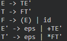
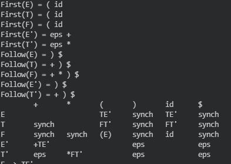
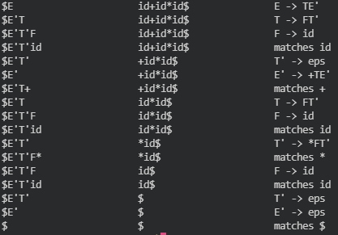
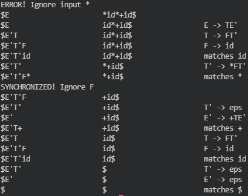
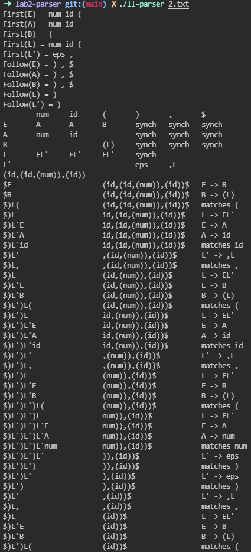
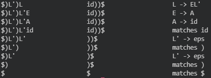
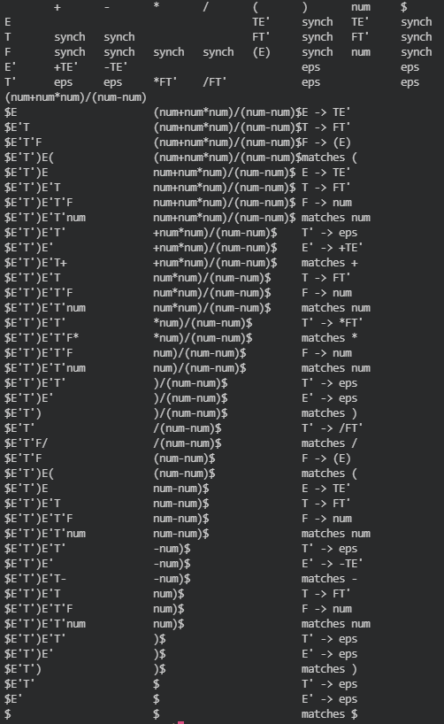
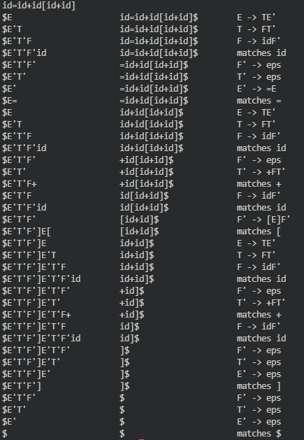

语法分析程序的设计与实现

娄司宇 2019211452

2021.11.6

## 实验环境
本实验在Ubuntu 20.04下，使用g++ 9.3.0开发。

## 使用方法

执行程序，并以语法文件名作为参数

`./ll-parser path/to/file`

输入待分析表达式

## 程序设计

本程序主要分为2个部分:
1. 读入产生式、预处理以及生成预测分析表
2. 通过预测分析表进行语法分析

### 核心数据结构与函数设计
```cpp
Struct Parser {
	// 非终结符号、终结符号表
	std::unordered_map<STR, int> terminals, nonterminals;
	VS tt, nt;
	using rhs_t = V<PII>; // 存储产生式右侧的结构
	V<V<rhs_t>> productions; // 产生式
	V<int> could_be_epsilon, vis; // 处理非终结符号是否可能推出空
	V<std::set<int>> first, follow; // first、follow集
	V<V<int>> table; // ll(1) 预测分析表
	// 消除左递归、提取左公因子
	void convert();
	// 求first集
	std::set<int> getFirst(rhs_t x);
	// 求follow集
	void getFollow();
	// 构造预测分析表
	void construct();
	// LL(1)预测分析
	void parse(const STR& str);
};
```

### 构造预测分析表
首先从文件中读入目标语法的产生式。

产生式使用`vector<pair<int,int>>`的结构进行存储，这样可以存储单个产生式中每一个符号和属性。

读入后，对文法进行初步处理，消除直接左递归，并且提取左公因子以改造文法。

经过初步处理，便可以使用相应的算法，求出文法非终结符号的`FIRST`和`FOLLOW`集，并进一步构建预测分析表。

以文法
```
E -> E+T | T
T -> T*F | F
F -> (E) | id
```
为例:

消除左递归后得到如下产生式



求出相应`FIRST`、`FOLLOW`集和预测分析表



其中`synch`是用于辅助错误处理的同步信息，以实现应急的错误处理。

相关核心代码：

```cpp
    // 构造预测分析表
    void construct() {
        for (int i = 0; i < productions.size(); ++i)  {
            for (int j = 0; j < productions[i].size(); ++j) {
                auto fi = getFirst(productions[i][j]);
                bool flg = 0;
                for (auto& it: fi) {
                    flg |= (it == eps_id);
                    if (table[i][it] != -1 && table[i][it] != j)
                        throw std::runtime_error("is not LL(1) grammar!\n");
                    table[i][it] = j;
                }
                if (flg) {
                    for (auto& it: follow[i]) {
                        if (table[i][it] != -1 && table[i][it] != j)
                            throw std::runtime_error("is not LL(1) grammar!\n");
                        table[i][it] = j;
                    }
                }
            }
            for (auto& it: follow[i]) { // 加入同步信息
                if (table[i][it] == -1)
                    table[i][it] = synch;
            }
        }
    }
```


### LL(1)预测分析
如果上述步骤能够成功执行，则代表是一个`LL(1)`文法，可以进行相应的预测分析。

调用`parser.parse()`函数，能够对一个字符串进行相应语法分析。

考虑使用上述文法，分析以下字符串的运行结果：

1. 分析`id+id*id`



程序成功分析该表达式。

2. 分析`*id*+id`



**对于错误的表达式，进行了正确的应急处理。**

## 部分测试结果

+ 例1

```
E -> A | B
A -> num | id
B -> (L)
L -> EL'
L' -> ,L | eps
```

 

+ 例2
```
E -> E+T | E-T | T
T -> T*F | T/F | F
F -> (E) | num
```
(first,follow输出略去)




+ 例3(验证消除直接左递归、左公因子的正确性)
```
E -> T=E | T
T -> T+F | F
F -> F[E] | (E) | id
```
(first,follow输出略去)



## 实验心得
这次试验让我深入认识了LL(1)文法以及预测分析过程，让我在编译原理方面与编程水平上均有很大的提高。这次实验对我而言是一次宝贵且有收获的经历。
