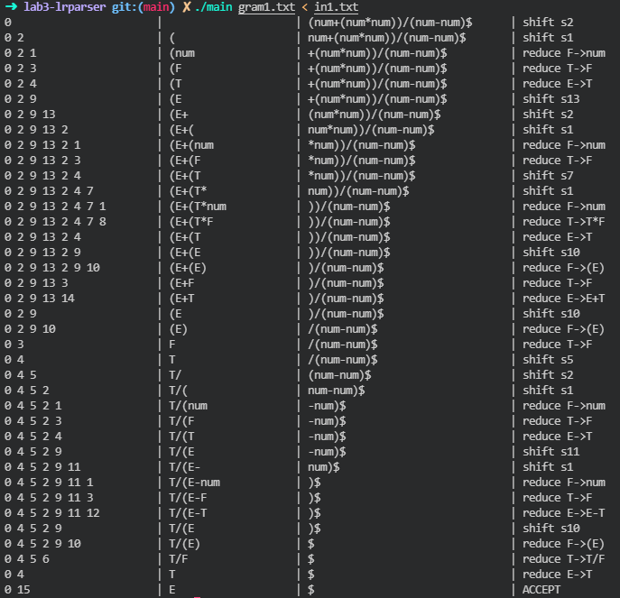
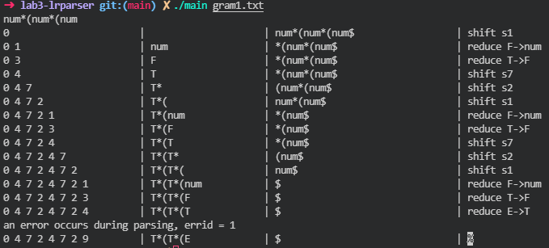
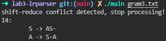

语法分析程序的设计与实现

娄司宇 2019211452

2021.12.9

## 实验内容
本实验实现了对于任何给定的SLR(1)文法，构造LR(0)项目集规范族及识别其所有活前缀的DFA，并对输入符号串进行分析。

程序在Ubuntu 20.04下，使用g++ 9.3.0开发。

## 使用方法

执行程序，并以语法文件名作为参数

`./main path/to/file`

输入待分析表达式

## 程序设计

本程序主要分为3个部分:
1. 读入产生式
2. 初始化、构建DFA
3. 通过预测分析表进行语法分析

### 核心数据结构与函数设计
```cpp
struct Parser
{
	int start;
	int testid, eofid;
	int state_cnt = 0;
	std::vector<Symbol> stable;				 // symbol table
	std::unordered_map<std::string, int> ht; // hashtable
	State *start_state;
	hashnode hn[MAXN]; // state hash table

	unsigned statehash(const State &);
	void insert_state(unsigned key, void *val);
	unsigned hv;

	void init(char *);
	void readgram(const char *file);
	void print_rhs(const rhs_t &rhs) const;
	void print_rules() const;
	void print_item(const item &) const;
	void print_state(const State &) const;
	void print_table(const State &) const;
	int add_symbol(const std::string &sym);
	int find_symbol(const std::string &sym);
	void add_action(State &, int, void *, int);
	void get_start_state();
	State *get_state(State &st);
	State *find_state(const State &);
	std::set<int> get_first(rhs_t x);
	void get_follow();
	static bool rulecmp(const item &, const item &);
	bool statecmp(const State &, const State &);
	void build_shift(State &);
	bool update_item(std::vector<item> &, item &);
	void lookhead_init(State &);
	std::vector<item> build_closure(std::vector<item>);
	void parse(const std::string &str);
	rhs_t load_token(const std::string &str);
	Parser();
};
```

### 程序初始化
首先从文件中读入目标产生式，将各类符号计入符号表。

程序会在读取文法时，会需要要求所输入的文法满足拓广文法的要求，并默认第一个非终结符是文法的起始符号。

其次分别计算出每一个符号的first集、非终结符号的follow集，以便后续构建分析表使用。

### 构造DFA
从起始符号开始，程序会开始递归地求出DFA的各项状态。

大致流程如下：
+ 将起始符号的唯一产生式加入初始状态的核心项目集合
+ 对于一个DFA状态，根据项目中`·`的位置拓广项目集合，并记录对应的动作(移进、归约)
+ 如果是一个移进项目，找到对应的目标状态，通过状态哈希表寻找这个状态是已经生成过：如果已经存在，指向这一状态，否则继续产生一个新项目集合去拓展。
+ 如果是一个待约项目，记录对应的规约产生式

使用这样的流程我们就能同时构造出DFA和相应的分析表

### 分析过程
分析过程使用了教材上算法4.3，具体实现如下
```cpp
void Parser::parse(const std::string &str)
{
	rhs_t tok = load_token(str);
	std::deque<State *> s; // state stack
	s.push_front(start_state);
	std::deque<int> t; // symbol stack
	int ip = 0;
	int errid = 0;
	while (1)
	{
		std::string buf;
		// printing state stack
		for (auto it = s.rbegin(); it != s.rend(); ++it)
			buf += std::to_string((*it)->index) + " ";
		printf("%-20s\t", buf.c_str());
		buf = "";
		// printing symbol stack
		for (auto it = t.rbegin(); it != t.rend(); ++it)
			buf += stable[*it].name;
		printf("| %-20s| ", buf.c_str());
		// printing buffer
		buf = "";
		for (int i = ip; i < tok.size(); ++i)
			buf += stable[tok[i]].name;
		printf("%-24s\t| ", buf.c_str());

		State *S = s.front();
		int a = tok[ip];
		if (!S->act.count(a))
		{
			errid = 1;
			goto Error;
		}
		if (S->act[a].type == action::SHIFT)
		{
			printf("shift s%d\n", S->act[a].x.stp->index);
			t.push_front(tok[ip++]);
			s.push_front(S->act[a].x.stp);
		}
		else if (S->act[a].type == action::REDUCE)
		{
			rule *rp = S->act[a].x.rp;
			int len = rp->rhs.size();
			while (len--)
				t.pop_front(), s.pop_front();
			S = s.front();
			t.push_front(rp->lhs);
			if (!S->act.count(rp->lhs))
			{
				errid = 2;
				goto Error;
			}
			s.push_front(S->act[rp->lhs].x.stp);
			printf("reduce ");
			printf("%s->", stable[rp->lhs].name.c_str());
			print_rhs(rp->rhs);
			printf("\n");
		}
		else if (S->act[a].type == action::ACCEPT)
		{
			printf("ACCEPT\n");
			return;
		}
	}
	errid = 3;
Error:
	fprintf(stderr, "an error occurs during parsing, errid = %d\n", errid);
	exit(-1);
}
```

## 部分测试结果

+ 例1

```
# 文法:
E' := E
E := E + T
E := E - T
E := T
T := T * F
T := T / F
T := F
F := ( E )
F := num

#符号:
(num+(num*num))/(num-num)
```
运行结果



+ 例2
```
# 文法：
同例1

# 符号
num*(num*(num
```


输入了错误的符号串，中止分析。

+ 例3
```
#文法:
S' -> S
S -> A S
S -> b
A -> S A
A -> a
```
运行结果：



在构造时，能够发现存在移进-归约冲突，因此该文发并非SLR(1)文法，中止DFA构造。
